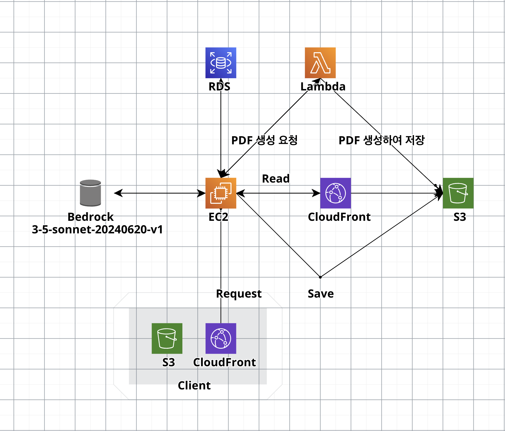

# AWS 아키텍처 다이어그램


- CloudCraft를 사용하여 제작
- 웹은 Vanlia.js를 사용하여 S3 버킷에 업로드하였고, 앱은 Flutter를 사용하여 개발
- 서버는 Java, Spring Boot로 개발
    - 서버는 EC2로 구성
    - 필요한 데이터는 RDS를 통해 저장
    - 이미지/텍스트 기반 AI를 사용하기 위해 Bedrock을 사용
        - 많은 모델 중 Claude 3.5 Sonnet이 이미지 프로세싱이 가능하기 때문에 사용했습니다. BedRock을 통해 맞춤형 LLM 서비스, 이미지 기반 AI 인증 기능을 구현
    - 서버 내에서 사진을 저장하는 기능은 S3 버킷에 저장하도록 구현
    - 이미지를 불러올 때 CloudFront를 활용하여 CDN을 거치도록 구성
- Lambda는 Python 3버전을 사용하여 코드를 작성
    - 전달받은 파라미터 기반으로 정해진 템플릿의 PDF를 만들고, S3 버킷에 저장하도록 구성 


해커톤 기간 동안 `43.203.144.204:8080` 로 테스트 해보실 수 있습니다.


# API Spec
### 1. 유저의 적금 가져오기

* 적금 정보 없을 때 → 이름, 적금 정보는 null로 응답
* 적금 정보 있을 때 → 이름, 잔액, 적금명, 은행 응답


> GET /users/{userId}/savings


요청 파라미터

* userId: 유저 ID

응답

* 적금 정보가 있을 때
```
{
    "id": 1,
    "name": "테스트",
    "saving": {
        "bank": "그린은행",
        "savingsName": "그린적금",
        "interestRate": 1.8,
        "balance": 100000
    }
}
```


* 적금 정보가 없을 때
```
{
    "id":1,
    "name":"테스트",
    "saving":null
}

```

### 2. 적금 연동하기

* 잔액, 적금명, 은행을 입력 받아 DB에 저장

> POST /users/{userId}/savings

요청 바디
```
{
    "bank": "그린은행",
    "savingsName": "그린적금",
    "interestRate": 1.8,
    "balance": 100000
}
```

예시
```
curl --location 'http://localhost:8080/users/2/savings' \
--header 'Content-Type: application/json' \
--data '{
"bank": "그린은행",
"savingsName": "그린적금",
"interestRate": 1.8,
"balance": 100000
}'
```


### 3. 인증 생성
* 사용자가 선택한 카테고리 + 인증 사진
    * AI가 인식한 카테고리와 다를 때 → 더 비슷한 카테고리로 추천 + 실패 응답
    * AI가 인식한 카테고리와 같을 때 → DB에 저장 + 성공 응답

> POST /certifications


요청 파라미터
```
// JSON이 아님
file = MultipartFile로 전달 (jpg)
userId = 유저 아이디
category = 유저가 선택한 카테고리
```


예시 & 응답 (AI가 인식한 카테고리와 다를 때)
```
curl -F 'file=@/home/ec2-user/upcycling/src/main/resources/static/1.jpg' -F 'userId=1' -F 'category=테스트' localhost:8080/certification
```

```
{"suggestion":"다회용기 포장"}
```

예시 & 응답 (AI가 인식한 카테고리와 같을 때)
```
curl -F 'file=@/home/ec2-user/upcycling/src/main/resources/static/1.jpg' -F 'userId=1' -F 'category=다회용기 포장' localhost:8080/certificatio
```

```
{"message":"success"}
```

### 4. Q&A

* 요청온 질문을 바탕으로 LLM으로 응답

" POST /ai/question


요청 파라미터
```
{
    "question": "저축한도가 어떻게 돼?"
}
```


예시 & 응답 (아는 내용일 때)
```
curl --location 'http://localhost:8080/ai/questions' \
--header 'Content-Type: application/json' \
--data '{
"question": "저축한도가 어떻게 돼?"
}'
```

```
{"message":"저축한도는 100만원 이하입니다. 월 최대 100만원까지 저축할 수 있습니다."}
```


예시 & 응답 (모르는 내용일 때)
```
curl --location 'http://localhost:8080/ai/questions' \
--header 'Content-Type: application/json' \
--data '{
"question": "인하대 맛집 추천해줘"
}'
```

```
{"message":"죄송합니다. 제가 담당하는 업무는 적금 관련 Q&A 상담입니다. 인하대 맛집 추천과 같은 다른 주제에 대해서는 정보를 제공해드리기 어렵습니다. \n\n적금 관련 문의사항이 있으시다면 말씀해 주시기 바랍니다. 만약 다른 주제에 대한 문의사항이 있으시면, 상담 직원에게 유선으로 문의해 주시기 바랍니다 (02-1234-5678). 또는 저희 홈페이지(www.green.com)를 참고해 주시기 바랍니다."}
```


### 5. 미션 목록 불러오기

* userId, 수행 여부


> GET /users/{userId}/missions


예시 & 응답
```
curl 'http://localhost:8080/users/1/missions‘
```

```
{
    "missions": [
        {
            "id": 1,
            "title": "다회용기 포장",
            "description": "일회용 플라스틱 사용을 줄여 해양과 육지의 플라스틱 오염을 방지합니다.",
            "iconUrl": "https://github.com/user-attachments/assets/cf6406b4-75be-433d-920e-c6d84d5d49c0",
            "isCompleted": true,
            "imageUrl": "d23fpzkzsmv7d3.cloudfront.net/1/065cdaae-ff48-4747-adc8-e8b6aae36d93"
        },
        {
            "id": 2,
            "title": "대중교통 이용",
            "description": "자동차 배출가스를 줄여 대기 오염을 감소시키고, 탄소 발자국을 줄입니다.",
            "iconUrl": "https://github.com/user-attachments/assets/cf6406b4-75be-433d-920e-c6d84d5d49c0",
            "isCompleted": false,
            "imageUrl": null
        },
        {
            "id": 3,
            "title": "걸음 수 인증",
            "description": "차량 사용을 줄이고, 건강한 생활을 촉진하면서 대기 오염을 줄입니다.",
            "iconUrl": "https://github.com/user-attachments/assets/9c729a79-156f-4dbd-935f-4e9f4a0d3906",
            "isCompleted": false,
            "imageUrl": null
        },
        {
            "id": 4,
            "title": "공유자전거 이용",
            "description": "자동차 사용을 줄여 온실가스 배출을 감소시키고, 도시의 혼잡도를 줄입니다.",
            "iconUrl": "https://github.com/user-attachments/assets/98c34c86-ad6e-4a03-a369-a68726311b5f",
            "isCompleted": false,
            "imageUrl": null
        },
        {
            "id": 5,
            "title": "해양쓰레기 수집",
            "description": "해양 생태계를 보호하고, 해양 생물에게 해를 끼치는 플라스틱 쓰레기를 줄입니다.",
            "iconUrl": "https://github.com/user-attachments/assets/115a7f3c-b5bc-456b-8db3-0cbd7763bdea",
            "isCompleted": false,
            "imageUrl": null
        }
    ]
}
```


### 6. 미션 상세보기

* 미션 타이틀, 설명, 미션 수행 여부, 인증 사진

> GET /users/{userId}/missions/{missionId}

예시 & 응답
```
curl http://localhost:8080/users/1/missions/1
```

```
{
    "title": "다회용기 포장",
    "description": "일회용 플라스틱 사용을 줄여 해양과 육지의 플라스틱 오염을 방지합니다.",
    "isCompleted": true,
    "imageUrl": "d23fpzkzsmv7d3.cloudfront.net/1/065cdaae-ff48-4747-adc8-e8b6aae36d93"
}
```


### 7. 나무의 감사편지

* 적금을 달성했을 때 나무의 감사편지를 전달해줌
* lambda 함수 호출


> POST /users/{userId}/letters


예시 & 응답
```
curl --location --request POST 'http://localhost:8080/users/1/letters'
```

```
{"message":"success"}
```


### 8. 나무의 감사편지 조회

* 적금을 달성했을 때 전달받은 나무의 감사편지 조회


> GET /users/{userId}/letters


예시 & 응답
```
curl http://localhost:8080/users/1/letters
```

```
{
    "pdfLink": "d23fpzkzsmv7d3.cloudfront.net/1/pdf/certifictaion.pdf“
}
```


